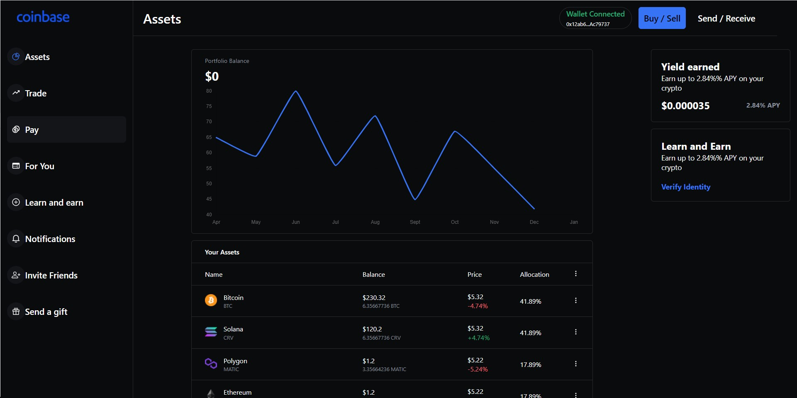

Coinbase Blockchain Web 3.0 App using Next.js, Sanity.io, thirdweb

## Website

https://fm-coinbase-blockchain-app-ephraim888sun.vercel.app/

 👉  Built a Web 3.0 Application with Next JS
 👉  Styled my app using Styled Components
 👉  Create and minted my own Cryptocurrency Tokens using the thirdweb SDK
 👉  Added Web 3.0 authentication using Metamask
 👉  Stored data and information about the tokens I've created in Sanity.io 
 👉  Used GROQ to retrieve data from Sanity Studio and display it in my Web 3.0 App
 👉  Created a send and receive functionality for my tokens on the blockchain
 👉  Deployed and hosted the app on Vercel 

  
  

